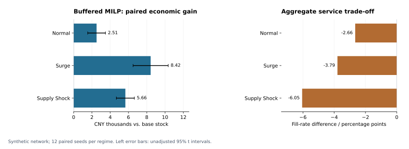
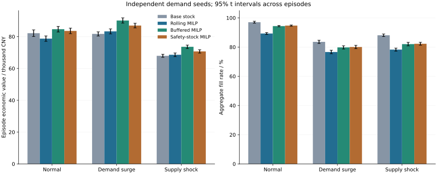
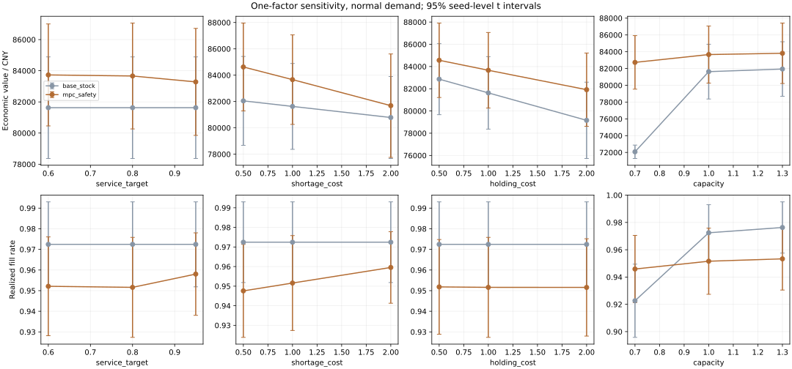

# Inventory Allocation Optimization

**Operations Research & Decision Optimization** · Quantitative Decision Science · Selected Project 01 · Flagship

  

[Portfolio](https://github.com/xsm-math) · [01 Inventory](https://github.com/xsm-math/inventory-allocation) · [02 Credit Risk](https://github.com/xsm-math/Risk-Modeling) · [03 Gold Allocation](https://github.com/xsm-math/invest)

| Project Summary | Rolling replenishment and allocation in a multi-warehouse, multi-channel, multi-SKU network; the flagship optimization study. |
|---|---|
| Research Question | How do forecast uncertainty and shared capacities change the economic value and service of rolling inventory decisions? |
| Methods | MILP, past-only demand forecasts, buffered/safety-stock policies, paired Monte Carlo evaluation and one-factor sensitivity. |
| Key Results | Across 144 synthetic episodes, buffered MILP improves mean economic value by **3.06% / 10.31% / 8.33%** in normal / surge / supply-shock regimes; aggregate fill rates remain below base stock. |
| Evidence | [Paired comparisons](results/network/paired_comparisons.csv), [aggregate service](results/network/aggregate.csv), [experiment provenance](results/network/metadata.json). These are simulated outcomes, not realized operational savings. |



## Abstract

This project studies joint replenishment and allocation in a multi-warehouse, multi-store-channel, multi-SKU inventory network. A rolling mixed-integer linear program coordinates procurement, delayed ground shipments, and same-day express shipments under shared capacities and fixed dispatch charges. Four policies are evaluated using paired Monte Carlo trajectories: a base-stock heuristic, point-forecast MILP, buffered-forecast MILP, and explicit safety-stock MILP. The study separates planning objectives from realized accounting, compares service and economic value, and examines sensitivity to service targets, shortage costs, holding costs, and transport capacity. All data are synthetic; the contribution is a reproducible computational experiment and validated implementation, not a new optimization algorithm or evidence of operational savings.

## Problem Definition

Three warehouses supply five retail channels/store groups with two SKUs over 21 daily decisions. Ground shipments take one or two days; express takes zero days; procurement takes two days. Orders are placed before the day's demand is revealed. Unserved demand is lost. The decision problem is to allocate limited inventory and transport capacity while balancing heterogeneous sales margins, shortage penalties, freight, fixed dispatch charges, and holding costs.

All policies receive identical uncensored historical demand, starting inventory, costs, and today's supply restrictions. Future demand and disruption recovery dates are withheld. See [data provenance](data/README.md) and the [event sequence and model](docs/network_model.md).

## Mathematical Formulation

Integer orders $q_{twp}$ and shipments $x_{twcmp}$ are coupled with binary lane activations $z_{twcm}$. Inventory, sales, lost demand, and regularization slack are continuous nonnegative auxiliary variables. The objective is

$$\min\; C_{procurement}+C_{freight}+C_{dispatch}+C_{holding}+C_{lost}+C_{service}+C_{reserve}-R_{sales}-V_{terminal}.$$

Constraints enforce warehouse and channel inventory balance with pipeline arrivals, supplier limits, procurement budgets, shared warehouse throughput, and lane volume capacity $\sum_p v_p x_{twcmp}\le K_m z_{twcm}$. A soft horizon-service target satisfies $\sum_t y_{tcp}+e_{cp}\ge\rho\sum_t\widehat d_{tcp}$. Fixed dispatch costs and indivisible shipment units motivate MILP. The [full formulation](docs/network_model.md) defines every term and boundary convention.

The safety-stock variant adds $I^C_{tcp}+b_{tcp}\ge a_t SS_{cp}$, with $SS_{cp}=\lceil z_{0.9}\widehat\sigma_{cp}\sqrt{L^q}\rceil$ estimated from past-only forecast residuals. The taper releases reserve near the planning boundary. Slack is penalized to retain feasibility under shortages. This normal approximation is a policy heuristic, not a chance constraint or guaranteed 90% fill rate.

## Data

All demand is synthetic. The reference network has three warehouses, five retail channels, two SKUs, 42 historical days and 21 daily operating decisions. Costs and capacities are illustrative CNY parameters in [the configuration](configs/network.json). [Data provenance](data/README.md) specifies the process and information available to every policy.

## Methodology

| Component | Implementation |
|---|---|
| Demand | Weekly Poisson-lognormal process with common and local variability; 42 historical days. |
| Forecast | Seven-day level plus same-weekday history; rolling evaluation against recent mean and seasonal naive. |
| Baseline | Feasible base-stock allocation, immediate express coverage, cost-ordered ground replenishment, geographical procurement shares. |
| Rolling MILP | Five-day lookahead; execute only today's actions, observe demand, update state, reoptimize. |
| Buffered MILP | Add 0.4 historical standard deviations to point forecasts. |
| Safety-stock MILP | Keep point forecasts; separately penalize inventory below a residual-based reserve target. |
| Uncertainty evaluation | Independent Monte Carlo demand paths, common random numbers across policies, paired seed-level intervals. |
| Validation | Independent tiny-instance enumeration, physical conservation, cost reconciliation, no-future-access checks, feasible-incumbent fallback. |

The controller is deterministic forecast-based optimization. Monte Carlo is used for evaluation, not multistage stochastic programming. Planning service/reserve penalties are regularizers excluded from the realized economic ledger. Realized shortage penalties are included.

## Experimental Design

The main study uses 12 seeds × three regimes × four policies = 144 episodes. Regimes are normal demand, a 45% demand surge, and a supplier-capacity/budget disruption. A matched horizon ablation retains the original 3/5/7-day study. The sensitivity study uses six separate seeds and three levels for each of four factors, comparing base stock and safety-stock MILP. Reference cells are reused; there are 108 unique sensitivity episodes. No parameter search or post-hoc best-policy selection is performed.

The solver receives two seconds per decision and a 2% relative MIP-gap tolerance. These settings apply to the planning model, not realized policy optimality. See the [experimental protocol](docs/network_experiments.md) for accounting, pairing, constraints, and statistical limitations.

## Results

<!-- RESULTS:START -->
| Regime | Policy | Economic value (CNY) | Fill rate | Worst-channel fill |
|---|---|---:|---:|---:|
| normal | Base stock | 82,168 | 97.03% | 94.68% |
| normal | Rolling MILP | 78,749 | 89.28% | 86.10% |
| normal | Buffered MILP | 84,679 | 94.37% | 91.56% |
| normal | Safety-stock MILP | 83,593 | 94.72% | 90.97% |
| surge | Base stock | 81,722 | 83.57% | 78.85% |
| surge | Rolling MILP | 83,314 | 76.64% | 66.48% |
| surge | Buffered MILP | 90,146 | 79.78% | 65.11% |
| surge | Safety-stock MILP | 86,971 | 80.07% | 65.37% |
| supply_shock | Base stock | 67,956 | 88.09% | 83.38% |
| supply_shock | Rolling MILP | 68,597 | 78.28% | 63.08% |
| supply_shock | Buffered MILP | 73,615 | 82.04% | 64.47% |
| supply_shock | Safety-stock MILP | 70,714 | 82.26% | 69.82% |

| Regime | Policy vs. base stock | Paired gain (CNY) | 95% interval half-width | Relative gain |
|---|---|---:|---:|---:|
| normal | Rolling MILP | -3,418 | 912 | -4.16% |
| normal | Buffered MILP | 2,512 | 966 | 3.06% |
| normal | Safety-stock MILP | 1,425 | 860 | 1.73% |
| surge | Rolling MILP | 1,592 | 1,697 | 1.95% |
| surge | Buffered MILP | 8,424 | 1,922 | 10.31% |
| surge | Safety-stock MILP | 5,249 | 1,580 | 6.42% |
| supply_shock | Rolling MILP | 641 | 979 | 0.94% |
| supply_shock | Buffered MILP | 5,660 | 986 | 8.33% |
| supply_shock | Safety-stock MILP | 2,759 | 976 | 4.06% |

Main study: 144 episodes; 0 fallback days; 1 time-limit days; maximum recorded MIP gap 2.00%.

Paired, unadjusted Student-t intervals describe seed variation within the synthetic model. They do not establish real-world savings or guarantee service.
<!-- RESULTS:END -->




Complete [research tables](docs/research_results.md), [interpretation](docs/findings.md), [episode metrics](results/network/episodes.csv), [paired comparisons](results/network/paired_comparisons.csv), [forecast evaluation](results/research/forecast_scores.csv), and [sensitivity episodes](results/research/sensitivity_episodes.csv) preserve the evidence. The sensitivity chart shows marginal seed-level intervals; paired differences are in a separate CSV.

## Robustness and Sensitivity Analysis

The [sensitivity study](docs/research_results.md) varies service targets, shortage penalties, holding costs and shared handling/transport capacities across six separate seeds and 108 unique episodes. Matched 3/5/7-day horizons and [scaling diagnostics](results/network/scaling.csv) examine planning choices and runtime. Small synthetic tests do not establish industrial scalability. Cross-cost-setting changes are not pure policy-efficiency effects; compare policies within each setting.

## Business Interpretation

Forecast buffering improves the realized economic ledger in the tested regimes, but the base-stock policy retains higher aggregate service. The point-forecast MILP loses 4.16% economic value in normal demand, showing that a more complex controller is not automatically better. A planner must state the margin, shortage-cost and service priorities before choosing a policy. [Detailed findings](docs/findings.md) retain worst-channel service and accounting boundaries.

## Limitations

- Synthetic, uncensored demand and illustrative CNY parameters require calibration before business use. Channels represent store groups, not validated individual outlets.
- Soft service and safety-stock targets can be violated; increased economic value need not improve aggregate or worst-channel service.
- The normal safety-stock approximation neglects serial correlation and does not model a full procurement-plus-distribution protection period. Express availability motivates the two-day reserve scale but does not establish an optimal reserve.
- Finite-horizon salvage, reserve taper, boundary-arrival restrictions, and unequal baseline/MILP lookahead affect results. No steady-state burn-in is claimed.
- There is no inter-warehouse transfer, stochastic transport delay, physical storage-volume limit, minimum dispatch lot, vehicle routing, or demand censoring model. Transport capacity and fixed dispatch costs are implemented.
- Small synthetic scaling tests and unadjusted intervals do not establish industrial scalability or general superiority. No new optimization algorithm is claimed.

## Future Work

Calibrate demand and economics using real store-level data; estimate censored demand; compare calibrated protection-period reserves and tuned baselines on separate validation sets; introduce nonanticipative scenario-tree optimization or CVaR; add storage and transfer decisions; evaluate longer operating periods with hard or risk-limited service requirements. Expand the scale study with diverse independent networks before making performance claims.

## Repository Structure

| Directory | Purpose |
|---|---|
| `supplychain/` | Existing source package: forecasting, network state, MILP, policies, simulator, experiments. |
| `configs/`, `data/` | Network parameters and synthetic-data provenance. |
| `tests/` | Model, simulator, forecasting, accounting, and regression validation. |
| `scripts/` | One-command reproduction and evidence-based report generation. |
| `results/network/`, `results/research/` | Raw metrics, solver diagnostics, plots, source/config hashes. |
| `docs/` | Formulation, experimental protocols, and research findings. |

The established package is retained rather than duplicated under `src/`. Demand seeds are fixed; solver versions and time limits can change selected incumbents across platforms. Manifests record source/config hashes and library versions. No exact cross-platform timing or incumbent equality is promised. Engineering attribution is preserved in [reference notes](docs/engineering_references.md).

## Reproducibility

Python 3.10+ from a repository checkout:

```bash
git clone https://github.com/xsm-math/inventory-allocation.git
cd inventory-allocation
python -m venv .venv
# Windows PowerShell:
.venv\Scripts\Activate.ps1
# macOS/Linux: source .venv/bin/activate
python -m pip install -r requirements.txt
python scripts/reproduce.py
```

The single command runs tests, the full comparison, sensitivity and forecast studies, scaling checks, and regenerates README/result tables. Allow several minutes depending on hardware; solver time limits can make a complete run longer. `requirements-lock.txt` records the exact environment used for committed results (Python version is in the manifests); older Python versions may need the compatible ranges in `requirements.txt`.

For one complete decision ledger:

```bash
python -m supplychain --policy mpc_safety --regime supply_shock --seed 101 --days 21
python server.py
```

The existing local interface is at http://127.0.0.1:8000. The interface supports all four policies and displays aggregate results and individual decision ledgers. The original single-period study remains available at `/single-period` and in [its report](docs/single_period_study.md).

Presentation-only summary: `python scripts/portfolio_summary.py --project inventory`. It reads the committed aggregates without running or changing the optimizer; input hashes are recorded in [the chart manifest](assets/portfolio/manifest.json).
