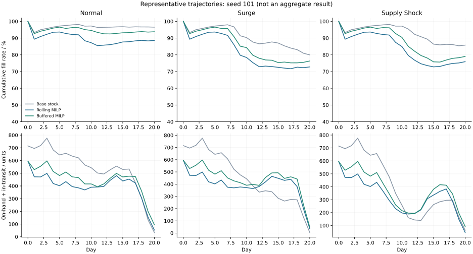

# Inventory Networks under Demand and Supply Uncertainty

**Joint replenishment and channel allocation with rolling mixed-integer optimization.**

## Abstract

This repository studies inventory decisions in a distribution network with delayed replenishment, heterogeneous channel demand, shared transport capacity, and fixed dispatch costs. A rolling-horizon mixed-integer linear program jointly determines supplier orders and warehouse-to-channel shipments. It is evaluated against a base-stock policy using independent synthetic demand trajectories and a separate physical simulator. The reference study comprises 108 episodes across normal demand, a demand surge, and a supplier-capacity/budget disruption. Adding a historical-variability buffer to the optimization forecasts improves mean economic value relative to the baseline in all three regimes, while aggregate and worst-channel service remain lower. Unbuffered optimization performs worse than the baseline under normal demand. These results distinguish the effect of forecast treatment from the mere use of a more elaborate optimizer.


## 1. Formulation

The reference network contains three warehouses, five channels, two products, and two transport modes. Ground transport takes one or two days; express transport arrives on the dispatch day. Supplier replenishment takes two days. Integer replenishment and shipment decisions share daily procurement, supplier, warehouse-throughput, and lane-capacity constraints. Binary lane activations incur fixed dispatch charges.

The planner minimizes acquisition, freight, dispatch, holding, and shortage costs less sales revenue and terminal inventory credit. A soft forecast-service target is included as a planning regularizer. It is a deterministic rolling MILP with an uncertainty-buffer variant, not a multistage stochastic program. The [mathematical formulation](docs/network_model.md) specifies balances, lead-time indexing, terminal treatment, information timing, and solver acceptance criteria.

| Component | Implementation |
|---|---|
| Demand model | Weekly Poisson-lognormal demand with shared and local variability; 42-day forecast history. |
| Forecast | Recent-level and same-weekday estimates; optional 0.4-standard-deviation buffer. |
| Controller | Five-day planning window, first-day execution, daily reoptimization. |
| Transport | Ground and express lanes, product-volume capacity, shared fixed dispatch costs. |
| Replenishment | Integer supplier orders, acquisition costs, two-day lead time, common budget. |
| Simulator | Order-before-demand events, explicit pipelines, lost sales, product-level conservation. |
| Solver | Sparse SciPy/HiGHS MILP; time/gap diagnostics and validated-incumbent fallback. |

## 2. Computational study

Each policy is evaluated on the same 12 seeds per regime, with 21 days per episode. Policies use observed history only; demand shocks and supply-recovery dates are withheld. All parameters and data are synthetic. Monetary values are illustrative CNY, and results are finite-horizon rather than steady-state estimates.

| Regime | Policy | Economic value (CNY) | Fill rate | Worst-channel fill |
|---|---|---:|---:|---:|
| Normal | Base stock | 82,168 | 97.03% | 94.68% |
| Normal | Rolling MILP | 78,696 | 89.24% | 86.00% |
| Normal | Buffered MILP | 84,753 | 94.41% | 91.79% |
| Surge | Base stock | 81,722 | 83.57% | 78.85% |
| Surge | Rolling MILP | 83,227 | 76.62% | 66.69% |
| Surge | Buffered MILP | 90,111 | 79.77% | 65.49% |
| Supply Shock | Base stock | 67,956 | 88.09% | 83.38% |
| Supply Shock | Rolling MILP | 68,425 | 78.24% | 63.38% |
| Supply Shock | Buffered MILP | 73,453 | 81.91% | 64.54% |

**Buffered MILP versus base stock:**

| Regime | Paired gain (CNY) | 95% interval half-width | Relative gain |
|---|---:|---:|---:|
| Normal | 2,586 | ±934 | 3.15% |
| Surge | 8,390 | ±1,926 | 10.27% |
| Supply Shock | 5,497 | ±896 | 8.09% |

Intervals use paired seed-level differences and a Student-t approximation. They quantify sampling variation within this synthetic model, not uncertainty about real-world performance. The [experimental protocol](docs/network_experiments.md) records complete policy definitions and statistical conventions.

The buffered controller reduces variable freight sufficiently to offset lower sales service and achieves higher economic value in these instances. This is not a Pareto improvement: channels with weaker economic incentives can receive substantially worse service, especially under disruption. The soft service target does not prevent this. The unbuffered controller loses 4.23% of baseline economic value under normal demand; solving a larger deterministic model does not remove forecast error.

The main benchmark recorded no fallback or time-limit days. The largest reported MIP gap was 1.99%, within the requested 2% tolerance. This is a solver bound on each planning model, not an optimality guarantee for the realized rolling policy.

## 3. Horizon and scale

A matched four-seed ablation compares 3-, 5-, and 7-day planning windows. Under normal demand, mean economic value is 66,813, 77,537, and 77,693 CNY, respectively. Under the supply shock it is 59,597, 67,223, and 67,724 CNY. The modest change from five to seven days contrasts with the larger short-horizon loss, though the experiment is too small to establish a universal horizon choice.

The largest dimension check uses eight warehouses, twenty channels, two products, and seven planning days: **7,824 variables, 6,832 integer/binary variables, and 3,029 constraints**. Three identical-instance timing repeats took approximately 0.44–0.46 seconds, including model assembly, with a 1.07% gap. These figures are specific to this execution environment and synthetic construction. Raw timings and solver outcomes are in [scaling.csv](results/network/scaling.csv).



## 4. Reproduction

Python 3.10+:

```bash
git clone https://github.com/xsm-math/inventory-allocation.git
cd inventory-allocation
python -m venv .venv
source .venv/bin/activate
# Windows PowerShell: .venv\Scripts\Activate.ps1
pip install -r requirements.txt

python -m unittest discover -s tests -v
python -m supplychain.benchmark --seeds 12 --days 21 --time-limit 2
python -m supplychain.scaling
python server.py
```

Open http://127.0.0.1:8000 for aggregate comparisons, representative trajectories, and bounded single-episode runs. The interactive endpoint uses a shorter 0.5-second per-day solve limit and reports its own solver outcomes. The interface and server run locally.

For a complete action trace:

```bash
python -m supplychain --policy mpc_buffered --regime supply_shock --seed 101 --days 21
```

Configuration is centralized in [configs/network.json](configs/network.json). Episode summaries, paired estimates, representative ledgers, and machine-readable reports are in [results/network](results/network). Environment versions and the configuration checksum accompany the outputs.

## 5. Implementation and validation

| Module | Responsibility |
|---|---|
| `network.py` | Input validation, observable stock/pipelines, action constraints. |
| `forecast.py` | Historical forecasts and synthetic demand generation. |
| `planner.py` | Sparse variable/constraint assembly, MILP solution, incumbent checks. |
| `policies.py` | Base-stock, point-forecast, and buffered controllers. |
| `simulation.py` | Event execution, accounting, conservation, and episode metrics. |
| `benchmark.py` / `scaling.py` | Replicated comparisons, ablations, plots, and size checks. |

Thirteen local tests cover the original marginal allocator and the network extension. They include independent small-instance enumeration, transport delays, budget and capacity violations, forced fallback, paired-demand consistency, and a future-demand perturbation check. Every simulated action is also checked for feasibility and product-level mass conservation. A GitHub Actions workflow defines the same test command; remote execution status should be checked on the repository's Actions tab.

## 6. Scope and references

The study uses synthetic uncensored demand and fixed economic parameters. It does not include inventory censoring, random transport delays, hard service guarantees, physical storage capacities, inter-warehouse transfers, vehicle routing, or learned policy selection. The buffered controller is a heuristic forecast adjustment, not robust optimization. Terminal salvage, finite-horizon restrictions, and baseline coverage choices affect the comparison. Claims of operational savings would require calibrated data and prospective evaluation.

Engineering references include [Stockpyl](https://github.com/LarrySnyder/stockpyl), [COIN-OR PuLP's transportation example](https://coin-or.github.io/pulp/CaseStudies/a_transportation_problem.html), and [SciPy/HiGHS](https://docs.scipy.org/doc/scipy/reference/generated/scipy.optimize.milp.html). [Reference notes](docs/engineering_references.md) identify what was adopted conceptually and what differs. No new optimization algorithm is claimed.

The earlier separable allocation study remains available as a [single-period companion experiment](docs/single_period_study.md), with its exact marginal-allocation proof, original results, and `python experiment.py` reproduction command. Its interface is at `/single-period`.
