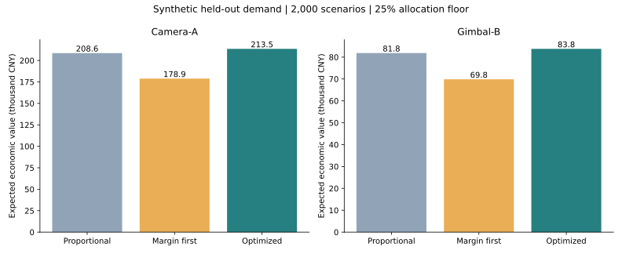

# Inventory Allocation under Uncertain Channel Demand

A computational study of single-period inventory allocation with heterogeneous margins, capacity constraints, and minimum channel allocations.

## Abstract

This study examines the allocation of limited inventory across sales channels before demand is observed. A sample-average objective combines sales contribution, shipping costs, holding costs, and shortage penalties. Discrete concavity permits an exact marginal-allocation algorithm for the resulting integer problem. The policy is compared with proportional and margin-priority rules using independent demand scenarios. In two synthetic product instances, optimized allocation increases mean economic value by 2.35% and 2.34% relative to proportional allocation, while slightly reducing aggregate demand fill rates. The results illustrate a trade-off between economic value and unit service rather than a uniform improvement across performance measures.

## 1. Problem formulation

For channel $i$, let $x_i$ denote allocated units, $c_i$ capacity, and $\widehat d_i$ forecast demand. Given central inventory $S$ and minimum allocation fraction $\alpha$, the feasible set is

$$
\mathcal X=\left\{x\in\mathbb Z_{\ge0}^{C}:\ \lceil\alpha\widehat d_i\rceil\le x_i\le c_i,\quad \sum_{i=1}^{C}x_i\le S\right\}.
$$

With random demand $D_i$, unit margin $m_i$, shipping cost $s_i$, holding cost $h_i$, and shortage penalty $p_i$, the objective is

$$
\max_{x\in\mathcal X}\ \mathbb E\!\left[\sum_{i=1}^{C}\left(m_i\min(D_i,x_i)-s_ix_i-h_i(x_i-D_i)^+-p_i(D_i-x_i)^+\right)\right].
$$

Here $(z)^+=\max(z,0)$. Minimum allocations are forecast-based quantity constraints, not guarantees on realized service levels. Economic value includes shortage penalties and therefore differs from accounting profit. All inputs are synthetic; monetary quantities are expressed in illustrative CNY.

## 2. Solution method

The expectation is approximated by an average over planning scenarios. The expected incremental value of the $k$th unit assigned to channel $i$ is

$$
\Delta_i(k)=(m_i+p_i+h_i)\widehat{\Pr}(D_i\ge k)-h_i-s_i.
$$

These increments are nonincreasing in $k$. Starting from the minimum allocations, a priority queue assigns each remaining unit to the channel with the largest positive increment, subject to capacity. This solves the empirical objective exactly under the stated constraints. The derivation and optimality argument appear in [Model and algorithm](model.md).

| Policy | Allocation rule |
|---|---|
| Proportional | Minimum allocations followed by capped forecast-weighted allocation and largest-remainder rounding. |
| Margin priority | Minimum allocations followed by descending unit margin net of shipping cost. |
| Marginal optimization | Minimum allocations followed by descending expected marginal value. |

The baselines dispatch available stock up to channel capacities. The optimized policy may retain inventory when all remaining increments are nonpositive. All policies dispatch the full stock in the reference experiment.

## 3. Experimental design

Two products are evaluated separately across five channels. Reference inventory is 620 units for Camera-A and 780 units for Gimbal-B, with $\alpha=0.25$. Demand follows a Poisson mixture with shared and channel-specific lognormal multipliers. Forecasts and economic parameters are specified directly rather than estimated from historical observations.

Each allocation is computed using 400 planning scenarios and evaluated on 2,000 independently seeded test scenarios. All policies face identical test demands. A sensitivity grid varies inventory from 50% to 110% of aggregate forecast and test-demand scale from 0.7 to 1.3. Demand shifts are not supplied to the planner. Full specifications are in [Experimental protocol](experimental_protocol.md).

## 4. Results



| Product | Policy | Mean economic value (CNY) | Demand fill rate | Mean channel leftovers (units) |
|---|---|---:|---:|---:|
| Camera-A | Proportional | 208,584.89 | 64.04% | 29.31 |
| Camera-A | Margin priority | 178,863.34 | 52.60% | 134.87 |
| Camera-A | Marginal optimization | 213,496.89 | 63.08% | 38.19 |
| Gimbal-B | Proportional | 81,845.04 | 64.85% | 39.00 |
| Gimbal-B | Margin priority | 69,849.27 | 53.51% | 168.60 |
| Gimbal-B | Marginal optimization | 83,763.82 | 64.13% | 47.20 |

Relative to proportional allocation, mean economic value increases by 4,912 CNY for Camera-A and 1,919 CNY for Gimbal-B. Approximate paired 95% Monte Carlo confidence intervals are $4{,}912\pm493$ and $1{,}919\pm181$ CNY. These intervals are conditional on the planning sample and assumed demand process.

The increase in economic value is accompanied by lower fill rates and higher channel leftovers. The optimizer favors units with higher expected economic returns rather than maximizing aggregate sales volume. Margin priority performs less well in these instances because its ordering does not account for demand saturation. These findings describe the reference instances; they do not establish dominance under other demand distributions or parameter settings.

## 5. Scope

The model assumes one warehouse, one period, linear channel costs, and separate inventory budgets for each product. It excludes replenishment, lead times, fixed shipping costs, transfers, and cross-product substitution. Central inventory has no modeled holding cost or future value. The experiment does not estimate real-world operating gains. Extensions involving multiple warehouses or coupled resource constraints require a different optimization formulation.

## Reproducibility

Python 3.10+; tested package versions are recorded in [docs/tested-environment.txt](tested-environment.txt).

```bash
git clone https://github.com/xsm-math/inventory-allocation.git
cd inventory-allocation
python -m venv .venv
source .venv/bin/activate
# Windows PowerShell: .venv\Scripts\Activate.ps1
pip install -r requirements.txt
python experiment.py
python -m unittest discover -s tests -v
python server.py
```

The optional experiment interface is available at http://127.0.0.1:8000. Generated tables and figures are stored in `results/`; source parameters are in `data/channels.csv`. Tests cover small-instance optimality by enumeration, feasibility, invalid inputs, zero demand, and reproducibility.
